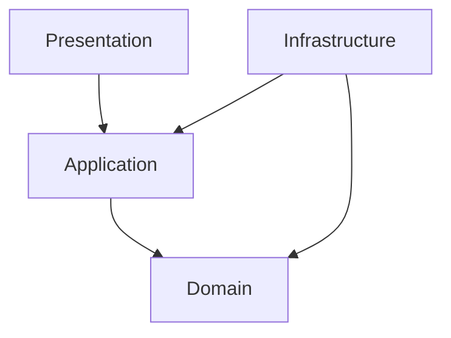

1. 概要

本ドキュメントでは、以下を対象にアーキテクチャ設計方針をまとめます：
	•	レイヤー構成と責務の分離
	•	レイヤー間の依存関係
	•	パッケージ構成とモジュール設計
	•	品質担保と静的解析の方針

⸻

2. レイヤードアーキテクチャ構成

4層のレイヤーを採用します。

レイヤー	主な責務
Presentation Layer	APIエンドポイントの提供、認証・認可、入力バリデーション
Application Layer	ユースケース処理、トランザクション管理、ドメイン層との橋渡し
Domain Layer	ビジネスロジックの中核（エンティティ、値オブジェクト、ドメインサービス）
Infrastructure Layer	DB、外部APIなど技術的関心の実装


⸻

3. 依存関係ルール
	•	上位レイヤーからのみ下位レイヤーへの依存を許容（逆依存禁止）
	•	ドメイン層は他のレイヤーに依存しない
	•	インフラ層はアプリケーション／ドメイン層のインターフェースを実装



⸻

4. パッケージ・モジュール構成

```
/project-root
  /domain
    /order
    /user
    /common
  /application
  /infrastructure
  /presentation
```

	•	ドメイン層は集約単位でサブパッケージ化
	•	各レイヤー単位でモジュール分割可能（Gradle/Mavenで明示的に依存制御）

⸻

5. スコープ・可視性の設計方針（Kotlin）

Kotlinではpackage-privateが存在しないため、以下の方針でスコープ制御を行います：
	•	エンティティの状態変更用プロパティはprivateまたはinternalで隠蔽
	•	外部からの操作を許可する関数（例: complete()）のみ public とし、他は internal
	•	ドメイン層のpublic API以外へのアクセスを internal によりモジュール内に制限
	•	infrastructure層の実装はinternalでパッケージ外からのアクセスを防止
	•	モジュール分割を活用して、internalによる物理的なアクセス制限を実現
	•	internalでも防げないケース（マルチモジュール間など）は、静的解析やレビューで統制

⸻

6. 品質担保

6.1 静的解析ツール
	•	Detekt: Kotlinコードのスタイル・品質検査
	•	ArchUnit: レイヤー間依存、パッケージ構造の検証

6.2 CI/CD連携
	•	Detekt/ArchUnitによるビルド時検証
	•	違反時はCIをfailに

検証ルール例：
	•	domain → application のみ依存可能（逆禁止）
	•	infrastructure以外からDBアクセス禁止
	•	controllerから直接ドメイン操作を禁止

⸻

7. コーディング／設計ガイドライン
	•	ドメインロジックはドメイン層で完結
	•	public setter／public field は禁止
	•	アプリケーションサービスはユースケース処理に特化
	•	ドメインイベントはドメイン層で定義し、必要に応じて発火／ハンドリング
	•	テストは各層で単体レベルを担保（ドメインロジック、ユースケース）

⸻

8. 運用・保守
	•	設計／実装ガイドラインの継続的見直し
	•	静的解析ルールの拡充
	•	ドキュメント、サンプルコードの定期更新
	•	レビューを通じた逸脱検知と即時修正

⸻

付録

ArchUnit サンプルコード

（別ファイルにコードとして分離推奨）
	•	レイヤー依存ルールのテスト（Presentation → Application → Domain）
	•	public setter禁止
	•	infrastructure層の制限

Detekt サンプル設定

（detekt.ymlファイルにて管理）
	•	コメント、複雑度、命名、例外処理などルールをプロジェクトに合わせて調整
	•	各ルールは active: true/false で切替可能
	•	--generate-config によりデフォルト生成後、プロジェクトに合わせて編集

⸻

以上をベースに、各プロジェクトに応じた調整や拡張を加えて運用してください。