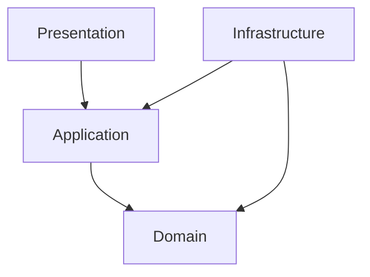

承知しました。DDDを取り入れたバックエンドアーキテクチャの開発ドキュメントのテンプレートとして、
レイヤー構成・依存関係・パッケージ設計・品質担保の仕組みまで含めてまとめます。
プロジェクトの設計方針や教育資料にも活用できる内容です。

⸻

バックエンドアーキテクチャ設計ドキュメント

⸻

1. 概要

本ドキュメントは、当プロジェクトのバックエンドシステム開発におけるアーキテクチャ設計方針を示します。
ドメイン駆動設計（DDD）の原則に則り、保守性・拡張性・品質を最大化するためのレイヤリング、依存関係、パッケージ構成、および品質担保の手法を定義します。

⸻

2. レイヤードアーキテクチャ構成

当システムでは4層レイヤードアーキテクチャを採用します。

2.1 レイヤー一覧と責務

レイヤー	主な責務
Presentation Layer	ユーザー・外部I/Fとの接点（Web API/画面）。入力バリデーション・認証認可等
Application Layer	ユースケースの実装・調整。トランザクション管理・ドメイン層との橋渡し
Domain Layer	ビジネスロジック本体（エンティティ・値オブジェクト・ドメインサービス等）
Infrastructure Layer	DB、外部API等の技術要素との接続。リポジトリや外部サービスの実装


⸻

3. 依存関係ルール
	•	上位レイヤーのみが下位レイヤーに依存する（逆依存は禁止）
	•	ドメイン層は他レイヤーに依存しない
	•	インフラ層はアプリケーション層・ドメイン層のインターフェースを実装する形で依存

依存関係図例：



⸻

4. パッケージ・モジュール設計

4.1 物理構成例（Kotlin/Java）

/project-root
  /domain
    /order
      Order.kt
      OrderLine.kt
      OrderRepository.kt
      OrderService.kt
      ...
    /user
      User.kt
      UserRepository.kt
      ...
    /common
      Address.kt
      ...
  /application
    OrderApplicationService.kt
    UserApplicationService.kt
    ...
  /infrastructure
    OrderRepositoryImpl.kt
    UserRepositoryImpl.kt
    ...
  /presentation
    OrderController.kt
    UserController.kt
    ...

	•	ドメイン層は集約単位でサブパッケージ化
	•	モジュール分割可能な場合はdomain/application/infrastructure/presentationで独立
→ GradleやMavenで依存性を明示的に管理

⸻

5. スコープ・可視性ポリシー
	•	エンティティのフィールド/状態変更はprivate/internal/package-privateで隠蔽
	•	ドメイン知識を反映した操作（例：complete()やapplyDiscount()）のみpublic
	•	ドメイン層のpublic API以外は他層からアクセスできないよう制御
	•	リポジトリ実装や外部API実装はinfrastructureパッケージで閉じる
	•	できる限り、モジュール/パッケージスコープで「物理的に」アクセス制御し、
それが困難な場合は静的解析やコードレビューで統制

⸻

6. 品質担保の仕組み

6.1 静的解析・アーキテクチャ検証
	•	Detekt
	•	Kotlinコードの命名規約・冗長記述・アンチパターン等を検出
	•	ArchUnit
	•	層間依存関係・パッケージ境界違反・命名規則などアーキテクチャルルールを検証

6.2 自動化（CI/CD連携）
	•	Detekt/ArchUnitはビルド時やCIパイプラインで自動実行し、違反時はfail
	•	ルール例
	•	domain→applicationは依存可、逆は禁止
	•	infrastructure以外からDBアクセス禁止
	•	コントローラから直接ドメイン層のメソッド呼び出し禁止　等

⸻

7. コーディング/設計ガイドライン
	•	ドメインロジックは必ずエンティティやドメインサービスを通して変更
	•	setterやpublicフィールドの直接アクセス禁止
	•	アプリケーションサービスはユースケース実装のみに徹し、業務ロジックはドメイン層に寄せる
	•	ドメインイベントはドメイン層で定義、必要に応じて発火・ハンドリング
	•	テストはドメイン層（ビジネスロジック）単体で担保、アプリ層でユースケース単体テストを用意

⸻

8. 運用・保守観点
	•	設計/実装ガイドラインの定期見直し
	•	ドキュメントやサンプルコードのアップデート
	•	静的解析ツールのルール拡充・CI強化
	•	チームでアーキテクチャ原則を共有し、逸脱時はレビューや分析で即時対応

⸻

付録：参考資料・テンプレート
	•	アーキテクチャ検証ルールサンプル（ArchUnit）
ArchUnitを使用してアーキテクチャルールを定義する際のサンプルコードです。
これらのルールは、プロジェクトのパッケージ構造に合わせて調整してください。
ベースパッケージは `com.mycompany.projectname` としています。

```kotlin
import com.tngtech.archunit.core.importer.ClassFileImporter
import com.tngtech.archunit.lang.syntax.ArchRuleDefinition.classes
import com.tngtech.archunit.lang.syntax.ArchRuleDefinition.noClasses
import com.tngtech.archunit.library.Architectures.layeredArchitecture
import org.junit.jupiter.api.Test

// プロジェクトのベースパッケージ
const val BASE_PACKAGE = "com.mycompany.projectname"

const val PRESENTATION_LAYER = "$BASE_PACKAGE.presentation.."
const val APPLICATION_LAYER = "$BASE_PACKAGE.application.."
const val DOMAIN_LAYER = "$BASE_PACKAGE.domain.."
const val INFRASTRUCTURE_LAYER = "$BASE_PACKAGE.infrastructure.."

// 許可する標準ライブラリパッケージ (必要に応じて追加)
val ALLOWED_STANDARD_PACKAGES = arrayOf(
    "java..",
    "kotlin..",
    "javax..", // Springなどのフレームワークで利用される場合
    "org.slf4j..", // Logging
    // プロジェクトで使用するその他の共通ライブラリ
    "com.fasterxml.jackson.." // Example: Jackson for JSON
)

class ArchitectureRulesTest {

    private val importedClasses = ClassFileImporter()
        .withImportOption { location ->
            // テストコードは検証対象外とする (任意)
            !location.contains("/test/")
        }
        .importPackages(BASE_PACKAGE)

    @Test
    fun `レイヤー間の依存関係ルール (layeredArchitecture 簡易版)`() {
        layeredArchitecture()
            .consideringAllDependencies()
            .layer("Presentation").definedBy(PRESENTATION_LAYER)
            .layer("Application").definedBy(APPLICATION_LAYER)
            .layer("Domain").definedBy(DOMAIN_LAYER)
            .layer("Infrastructure").definedBy(INFRASTRUCTURE_LAYER)

            // Presentation -> Application
            .whereLayer("Presentation").mayOnlyAccessLayers("Application")
            // Application -> Domain
            .whereLayer("Application").mayOnlyAccessLayers("Domain")
            // Domain -> No other layers (Domainレイヤは他レイヤに依存しない)
            .whereLayer("Domain").mayNotAccessAnyLayer()
            // Infrastructure -> Domain, Application (InfrastructureレイヤはDomainとApplicationのIFを実装・利用)
            // この layeredArchitecture の書き方では Infrastructure から上位への依存を直接表現しにくい
            // Infrastructure が Application や Domain の「インターフェース」に依存することは許容されるべき
            // より厳密には個別のルールで定義することを推奨 (下記参照)

            .check(importedClasses)
    }

    @Test
    fun `プレゼンテーション層の依存ルール`() {
        classes().that().resideInAPackage(PRESENTATION_LAYER)
            .should().onlyAccessClassesThat().resideInAnyPackage(
                PRESENTATION_LAYER, // 自身のパッケージ
                APPLICATION_LAYER,  // Application層
                *ALLOWED_STANDARD_PACKAGES
            )
            .because("プレゼンテーション層はアプリケーション層と標準ライブラリにのみ依存できます。")
            .check(importedClasses)
    }

    @Test
    fun `アプリケーション層の依存ルール`() {
        classes().that().resideInAPackage(APPLICATION_LAYER)
            .should().onlyAccessClassesThat().resideInAnyPackage(
                APPLICATION_LAYER, // 自身のパッケージ
                DOMAIN_LAYER,      // Domain層
                *ALLOWED_STANDARD_PACKAGES
            )
            .because("アプリケーション層はドメイン層と標準ライブラリにのみ依存できます。")
            .check(importedClasses)
    }

    @Test
    fun `ドメイン層の依存ルール`() {
        classes().that().resideInAPackage(DOMAIN_LAYER)
            .should().onlyAccessClassesThat().resideInAnyPackage(
                DOMAIN_LAYER, // 自身のパッケージ (サブドメイン間の依存は許容する場合)
                *ALLOWED_STANDARD_PACKAGES
            )
            .because("ドメイン層は他のレイヤーに依存せず、自身のパッケージと標準ライブラリにのみ依存できます。")
            .check(importedClasses)
    }

    @Test
    fun `インフラストラクチャ層の依存ルール`() {
        classes().that().resideInAPackage(INFRASTRUCTURE_LAYER)
            .should().onlyAccessClassesThat().resideInAnyPackage(
                INFRASTRUCTURE_LAYER, // 自身のパッケージ
                DOMAIN_LAYER,         // Domain層 (IF実装やエンティティ利用)
                APPLICATION_LAYER,    // Application層 (IF実装)
                *ALLOWED_STANDARD_PACKAGES
                // DBドライバ、外部APIクライアントライブラリなどもここに追加
            )
            .because("インフラストラクチャ層はドメイン層、アプリケーション層のインターフェース、自身のパッケージ、および標準/外部ライブラリに依存できます。")
            .check(importedClasses)
    }

    // より具体的なアクセス制御ルール
    @Test
    fun `ドメイン層のクラスは、アプリケーション層、プレゼンテーション層、インフラストラクチャ層のクラスへアクセスしないこと`() {
        classes().that().resideInAPackage(DOMAIN_LAYER)
            .should().noClasses().that().resideInAnyPackage(APPLICATION_LAYER, PRESENTATION_LAYER, INFRASTRUCTURE_LAYER)
            .because("ドメイン層はアプリケーション層、プレゼンテーション層、インフラストラクチャ層に依存してはいけません。")
            .check(importedClasses)
    }
    
    @Test
    fun `アプリケーション層のクラスは、プレゼンテーション層のクラスへアクセスしないこと`() {
        classes().that().resideInAPackage(APPLICATION_LAYER)
            .should().noClasses().that().resideInAPackage(PRESENTATION_LAYER)
            .because("アプリケーション層はプレゼンテーション層に依存してはいけません。")
            .check(importedClasses)
    }

    @Test
    fun `ドメインエンティティはpublicなsetterを持たない`() {
        // このルールは例であり、プロジェクトの設計に応じて調整が必要
        // 例えば、特定のパッケージパターンやアノテーションでエンティティを識別
        classes().that().resideInAPackage("$DOMAIN_LAYER..model..") // 例: ..domain..model.. にエンティティがある場合
            .and().areNotInterfaces() // インターフェースは除外
            .should(noPublicSettersCondition())
            .because("ドメインエンティティの状態変更はメソッド経由で行われるべきです。")
            .check(importedClasses)
    }

    // カスタムコンディションの例 (noPublicSettersCondition)
    private fun noPublicSettersCondition() =
        com.tngtech.archunit.lang.ArchCondition.from<com.tngtech.archunit.core.domain.JavaClass>("have no public setters") { javaClass, events ->
            javaClass.methods.filter { it.isPublic && it.name.startsWith("set") && it.rawParameterTypes.size == 1 }
                .forEach {
                    val message = String.format(
                        "Method %s.%s is a public setter in class %s",
                        javaClass.simpleName, it.name, javaClass.name
                    )
                    events.add(com.tngtech.archunit.lang.SimpleConditionEvent.violated(it, message))
                }
        }
}

```

上記のルールは基本的なものであり、プロジェクトの具体的なパッケージ構成や、
許可するライブラリの種類に応じてカスタマイズが必要です。
例えば、`ALLOWED_STANDARD_PACKAGES` にプロジェクトで使用する共通ライブラリや
フレームワークのパッケージを追加してください。

また、特定の命名規則（例: `*Repository` インターフェースは `domain` 層に、
`*RepositoryImpl` は `infrastructure` 層に配置するなど）のチェックも追加できます。
	•	Kotlinコーディング規約（Detekt）
DetektはKotlinの静的解析ツールで、コードの品質を維持し、規約を徹底するのに役立ちます。
以下は、Detektの設定ファイル (`detekt.yml` またはプロジェクトに合わせて `detekt-config.yml` など) のサンプルです。
これは `detekt --generate-config` で生成されるデフォルト設定をベースにしており、プロジェクトの要件に応じて各ルールセットや個別のルールを有効化/無効化、設定値の調整を行ってください。

**設定ファイルの基本構造:**

*   `build`: ビルドプロセスに関する設定（最大許容 इश्यू数など）。
*   `config`: Detekt自体の設定（設定ファイルのバリデーションなど）。
*   `processors`: プロジェクトメトリクスを計算するプロセッサーの設定。
*   `console-reports`: コンソールに出力するレポートの種類。
*   `output-reports`: ファイルとして出力するレポートの種類（HTML, XML, SARIFなど）。
*   各ルールセット (`comments`, `complexity`, `coroutines`, `empty-blocks`, `exceptions`, `naming`, `performance`, `potential-bugs`, `style`):
    *   `active`: ルールセット全体の有効/無効。
    *   個別のルール:
        *   `active`: ルールの有効/無効。
        *   ルール固有の設定値（閾値、許可/禁止パターンなど）。

**サンプル `detekt.yml`:**

```yaml
# build:
#   maxIssues: 0 # CIでビルドを失敗させるIssueの閾値。0はIssueがあれば失敗。
#   excludeCorrectable: false # 自動修正可能なIssueを除外するか

config:
  validation: true # 設定ファイルの妥当性を検証するか
  warningsAsErrors: false # Detekt設定の警告をエラーとして扱うか
  # excludes: '' # 検証から除外する設定パス (カスタムルールセットのプロパティなど)

# comments:
#   active: true
#   UndocumentedPublicClass:
#     active: false # 公開クラスのドキュメント強制 (プロジェクト初期はfalse推奨)
#   UndocumentedPublicFunction:
#     active: false # 公開関数のドキュメント強制 (プロジェクト初期はfalse推奨)
#   # ... 他のコメント関連ルール

complexity:
  active: true
  LongParameterList:
    active: true
    functionThreshold: 6 # 関数のパラメータ数の閾値
    constructorThreshold: 7 # コンストラクタのパラメータ数の閾値
    ignoreDefaultParameters: false
    ignoreDataClasses: true
  LongMethod:
    active: true
    threshold: 60 # メソッドの行数の閾値
  LargeClass:
    active: true
    threshold: 600 # クラスの行数の閾値
  CyclomaticComplexMethod:
    active: true
    threshold: 15 # メソッドのサイクロマティック複雑度の閾値
  NestedBlockDepth:
    active: true
    threshold: 4 # ネストブロックの深さの閾値
  TooManyFunctions:
    active: true
    thresholdInFiles: 15 # ファイル内の関数数の閾値 (デフォルトより少し緩和)
    thresholdInClasses: 15 # クラス内の関数数の閾値 (デフォルトより少し緩和)
  # ... 他の複雑度関連ルール

coroutines:
  active: true
  InjectDispatcher:
    active: true # Dispatcherの注入を推奨
  # ... 他のコルーチン関連ルール

empty-blocks:
  active: true
  EmptyCatchBlock:
    active: true
    allowedExceptionNameRegex: '_|(ignore|expected).*' # 許可する例外名
  EmptyFunctionBlock:
    active: true
    ignoreOverridden: false # オーバーライドされた空の関数を許可するか
  # ... 他の空ブロック関連ルール

exceptions:
  active: true
  TooGenericExceptionCaught:
    active: true
    exceptionNames: # 汎用的すぎるCatch対象の例外
      - 'Error'
      - 'Exception'
      - 'RuntimeException'
      - 'Throwable'
    allowedExceptionNameRegex: '_|(ignore|expected).*'
  TooGenericExceptionThrown:
    active: true
    exceptionNames: # 汎用的すぎるThrow対象の例外
      - 'Error'
      - 'Exception'
      - 'RuntimeException'
      - 'Throwable'
  PrintStackTrace:
    active: true # printStackTraceの使用を禁止
  # ... 他の例外処理関連ルール

naming:
  active: true
  ClassNaming:
    active: true
    classPattern: '[A-Z][a-zA-Z0-9]*' # クラス名の正規表現
  FunctionNaming:
    active: true
    functionPattern: '[a-z][a-zA-Z0-9_]*' # 関数名の正規表現 (スネークケースも許容する場合)
  PackageNaming:
    active: true
    packagePattern: '[a-z]+(\.[a-z][A-Za-z0-9]*)*' # パッケージ名の正規表現
  VariableNaming:
    active: true
    variablePattern: '[a-z][A-Za-z0-9]*' # 変数名の正規表現
  # ... 他の命名規則関連ルール

performance:
  active: true
  # ... パフォーマンス関連ルール

potential-bugs:
  active: true
  EqualsWithHashCodeExist:
    active: true # equalsをオーバーライドしたらhashCodeもオーバーライドする
  UnsafeCallOnNullableType:
    active: true # Null許容型への安全でない呼び出し (!!) を警告
  # ... 潜在的なバグ関連ルール

style:
  active: true
  MaxLineLength:
    active: true
    maxLineLength: 120 # 1行の最大長
    excludePackageStatements: true
    excludeImportStatements: true
  WildcardImport:
    active: true
    excludeImports: # ワイルドカードインポートを許可する例外
      - 'java.util.*'
      # - 'kotlinx.android.synthetic.*' # Androidプロジェクトで必要な場合など
  ForbiddenComment:
    active: true # 特定のコメント (TODO, FIXME) を警告
    comments: # 以前の versions では 'values:' でした
      - 'TODO:'
      - 'FIXME:'
      - 'STOPSHIP:'
    # allowedPatterns: '' # 許可するパターン (正規表現)
  MagicNumber:
    active: true
    ignoreNumbers: # 無視するマジックナンバー
      - '-1'
      - '0'
      - '1'
      - '2'
      - '100' # 例: パーセント計算など
      - '1000' # 例: ミリ秒変換など
    ignorePropertyDeclaration: true
    ignoreConstantDeclaration: true
    ignoreCompanionObjectPropertyDeclaration: true
    ignoreNamedArgument: true
    ignoreEnums: true
  ReturnCount:
    active: true
    max: 3 # 関数内の最大return数 (デフォルト2より少し緩和)
    excludeGuardClauses: true # ガード節を除外
  UnusedImports:
    active: true # 未使用のインポートを警告
  # ... 他のスタイル関連ルール (多数存在するため、公式ドキュメント参照)

```

**利用方法:**

1.  プロジェクトのルートディレクトリ、または指定の場所に上記のような内容で `detekt.yml` (または `detekt-config.yml`) を作成します。
2.  DetektのGradleプラグインやCLI実行時に、この設定ファイルを指定します。

    *   Gradleの場合 (`build.gradle.kts`):
        ```kotlin
        detekt {
            config.setFrom(files("path/to/your/detekt.yml"))
        }
        ```

**ポイント:**

*   **デフォルト設定の活用:** `detekt --generate-config` コマンドでプロジェクトのルートにデフォルト設定ファイルを生成し、それをカスタマイズのベースとするのが一般的です。
*   **ルールセットの選択:** プロジェクトの特性やチームの規約に合わせて、不要なルールセットやルールは `active: false` に設定します。
*   **閾値の調整:** `LongMethod` の行数や `LongParameterList` のパラメータ数など、閾値はプロジェクトの実情に合わせて調整します。最初から厳しすぎると開発効率が落ちる可能性があるため、段階的に厳しくしていくアプローチも有効です。
*   **`excludes` の活用:** 特定のファイルやディレクトリ（テストコード、生成コードなど）を解析対象から除外するには、各ルールやルールセットの `excludes` プロパティにGlobパターンで指定します。
*   **自動修正 (`--auto-correct`):** Detektは一部のルールについて自動修正をサポートしています。`--auto-correct` オプションを利用することで、手間をかけずにコードスタイルを統一できます。

このサンプルはあくまで出発点です。Detektの[公式ドキュメント](https://detekt.dev/docs/rules/style)（各ルールセットの詳細ページ）を参照し、チームで議論しながら最適な設定を見つけてください。

⸻

本ドキュメントをもとに、プロジェクト固有の方針・追加要件等を盛り込みながら運用してください。
詳細なサンプルや現場用の雛形もご要望あれば追加でご案内します。
