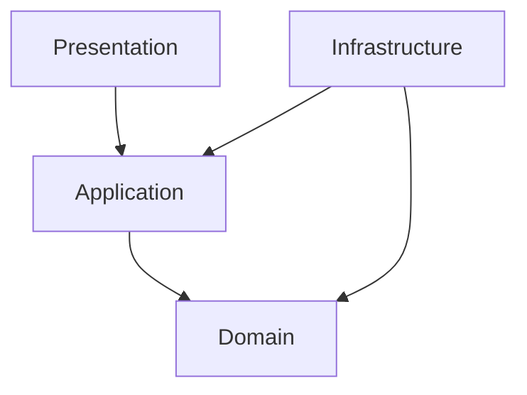

# バックエンドアーキテクチャ設計ドキュメント

---

## 1. 概要

本ドキュメントは、当プロジェクトのバックエンドシステム開発におけるアーキテクチャ設計方針を示します。  
ドメイン駆動設計（DDD）の原則に則り、保守性・拡張性・品質を最大化するためのレイヤリング、依存関係、パッケージ構成、および品質担保の手法を定義します。

---

## 2. レイヤードアーキテクチャ構成

当システムでは4層レイヤードアーキテクチャを採用します。

### 2.1 レイヤー一覧と責務

| レイヤー                | 主な責務                                                     |
|-----------------------|-------------------------------------------------------------|
| Presentation Layer    | ユーザー・外部I/Fとの接点（Web API/画面）。入力バリデーション・認証認可等 |
| Application Layer     | ユースケースの実装・調整。トランザクション管理・ドメイン層との橋渡し     |
| Domain Layer          | ビジネスロジック本体（エンティティ・値オブジェクト・ドメインサービス等） |
| Infrastructure Layer  | DB、外部API等の技術要素との接続。リポジトリや外部サービスの実装         |

---

## 3. 依存関係ルール

- 上位レイヤーのみが下位レイヤーに依存する（逆依存は禁止）
- ドメイン層は他レイヤーに依存しない
- インフラ層はアプリケーション層・ドメイン層のインターフェースを実装する形で依存

**依存関係図例：**



---

## 4. パッケージ・モジュール設計

### 4.1 物理構成例（Kotlin/Java）

```
/project-root
  /domain
    /order
      Order.kt
      OrderLine.kt
      OrderRepository.kt
      OrderService.kt
      ...
    /user
      User.kt
      UserRepository.kt
      ...
    /common
      Address.kt
      ...
  /application
    OrderApplicationService.kt
    UserApplicationService.kt
    ...
  /infrastructure
    OrderRepositoryImpl.kt
    UserRepositoryImpl.kt
    ...
  /presentation
    OrderController.kt
    UserController.kt
    ...
  /shared
    ...
```

- ドメイン層は**集約単位でサブパッケージ化**
- モジュール分割可能な場合は`domain`/`application`/`infrastructure`/`presentation`で独立  
  → GradleやMavenで依存性を明示的に管理

---

## 5. スコープ・可視性ポリシー

- エンティティのフィールド/状態変更は`private`/`internal`/package-privateで隠蔽
- ドメイン知識を反映した操作（例：`complete()`や`applyDiscount()`）のみpublic
- ドメイン層のpublic API以外は他層からアクセスできないよう制御
- リポジトリ実装や外部API実装はinfrastructureパッケージで閉じる
- できる限り、モジュール/パッケージスコープで「物理的に」アクセス制御し、  
  それが困難な場合は静的解析やコードレビューで統制

---

## 6. 品質担保の仕組み

### 6.1 静的解析・アーキテクチャ検証

- **Detekt**  
  - Kotlinコードの命名規約・冗長記述・アンチパターン等を検出
- **ArchUnit**  
  - 層間依存関係・パッケージ境界違反・命名規則などアーキテクチャルルールを検証

### 6.2 自動化（CI/CD連携）

- Detekt/ArchUnitはビルド時やCIパイプラインで自動実行し、違反時はfail
- ルール例
    - `domain`→`application`は依存可、逆は禁止
    - `infrastructure`以外からDBアクセス禁止
    - コントローラから直接ドメイン層のメソッド呼び出し禁止　等

---

## 7. コーディング/設計ガイドライン

- ドメインロジックは必ずエンティティやドメインサービスを通して変更
    - setterやpublicフィールドの直接アクセス禁止
- アプリケーションサービスはユースケース実装のみに徹し、業務ロジックはドメイン層に寄せる
- ドメインイベントはドメイン層で定義、必要に応じて発火・ハンドリング
- テストはドメイン層（ビジネスロジック）単体で担保、アプリ層でユースケース単体テストを用意

---

## 8. 運用・保守観点

- 設計/実装ガイドラインの定期見直し
- ドキュメントやサンプルコードのアップデート
- 静的解析ツールのルール拡充・CI強化
- チームでアーキテクチャ原則を共有し、逸脱時はレビューや分析で即時対応

---

## 付録：参考資料・テンプレート

- [アーキテクチャ検証ルールサンプル（ArchUnit）](https://www.archunit.org/userguide/html/000_Index.html)
- [Kotlinコーディング規約（Detekt）](https://detekt.dev/docs/introduction/overview/)

---

> 本ドキュメントをもとに、プロジェクト固有の方針・追加要件等を盛り込みながら運用してください。  
> 詳細なサンプルや現場用の雛形もご要望あれば追加でご案内します。
