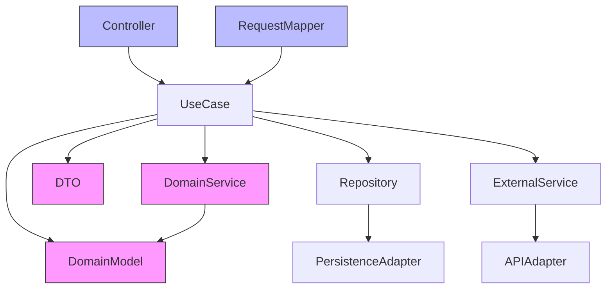

# コンポーネント間の関係性

このドキュメントでは、プロジェクトの各コンポーネント間の関係性について説明します。

## コンポーネント一覧

（ここにシステムの主要コンポーネント一覧を記載します）

## コンポーネント間の依存関係

（ここにコンポーネント間の依存関係を記載します）

## フロントエンドコンポーネント

フロントエンドは Remix (SPA mode) を採用しており、以下のディレクトリ構成に基づいて各コンポーネントを配置しています。

```
/app
├── routes/         # 各ページに対応するルーティング定義とUIロジック
├── components/     # 再利用可能なUIコンポーネント群（例: Button, Modal）
├── hooks/          # カスタムReactフック（例: useForm, useFetch）
├── utils/          # 汎用的なユーティリティ関数
├── services/       # 外部APIとの通信処理（fetch/axios 等）
├── models/         # ドメインモデルに相当する型定義やデータ構造
├── styles/         # グローバルCSSやTailwind設定
└── entry.server.tsx / entry.client.tsx  # Remix特有のエントリポイント
```

この構成は「関心の分離」に基づいており、リーダビリティと拡張性を重視しています。


## バックエンドコンポーネント

バックエンドはオニオンアーキテクチャを採用予定です。以下は想定される主要なコンポーネントとレイヤー構成です。

- **ドメイン層（最も内側）**
  - `Domain Model`: 業務ロジックの中心（例: LedgerEntry, Account）
  - `Domain Service`: モデルに属さないドメイン知識の実装

- **アプリケーション層**
  - `UseCase`: ドメイン層を操作するアプリケーション固有のロジック
  - `DTO`: 入出力データの構造（ドメインと外部を分離）

- **インフラ層**
  - `Repository`: DBアクセスの契約インターフェース
  - `ExternalService`: 外部APIアクセスの契約インターフェース
  - `Persistence Adapter`: DBアクセスの具象実装
  - `API Adapter`: 外部通信の具象実装

- **インターフェース層（最も外側）**
  - `Controller`: HTTPエンドポイント
  - `Request/Response Mapper`: データ変換
  - `ExceptionHandler`: 共通の例外ハンドリング

以下にレイヤー間の依存関係を示すMermaid図を記載します。



この構成により、内側のドメインロジックは外部の詳細（APIやDB）に依存せず、保守性とテスト容易性が高まります。

## インフラストラクチャコンポーネント

（ここにインフラストラクチャの主要コンポーネントとその関係性を記載します）

## 外部システム連携

（ここに外部システムとの連携ポイントとその関係性を記載します）

## 関連ドキュメント

- [システム構成図](./system-design.md)
- [データフロー図](./data-flow.md)
- [技術スタック](../02_tech-stack/frontend.md)
