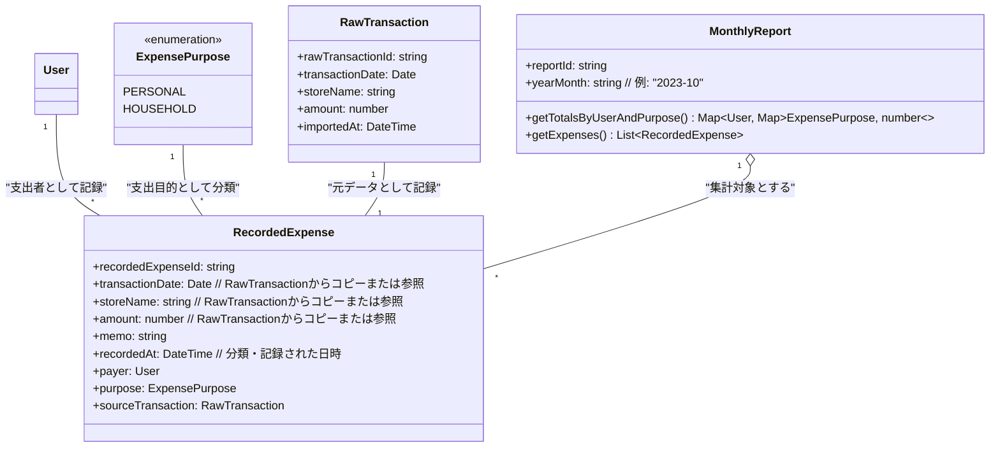

# ドメインモデル

このドキュメントでは、アプリケーションの主要なドメイン概念、それらの属性、および相互の関係について説明します。

## ドメイン用語集

| 日本語                   | 英語（候補）        | 説明                                                                                                |
| :----------------------- | :------------------ | :-------------------------------------------------------------------------------------------------- |
| **利用者**               | `User`              | 支出を行った、またはその支出の責任を負う主体（例: 「私」、「妻」）。                                       |
| **支出目的**             | `ExpensePurpose`    | その支出が個人のためのものか、家計のためのものかを示す区分。                                                       |
| **支出明細（元データ）** | `RawTransaction`    | クレジットカード会社からCSVでインポートされる、加工前の個々の取引記録。                                          |
| **記録済み支出**         | `RecordedExpense`   | インポートされた支出明細に、利用者と支出目的を割り当てて記録したもの。アプリケーションにおける家計簿の基本単位。 |
| **月次レポート**         | `MonthlyReport`     | 特定の月における、記録済み支出の集計結果。                                                                 |

## ドメインモデル図

## 各ドメイン概念の詳細

### 1. 利用者 (User)
*   **説明:** 支出を行った、またはその支出の責任を負う主体。
*   **主な属性:**
    *   `userId`: 利用者を一意に識別するID (例: `user_001`)
    *   `name`: 利用者の名前 (例: "私", "妻")
*   **関連:**
    *   `RecordedExpense` と1対多の関係 (一人の利用者は複数の記録済み支出を持つことができる)。

### 2. 支出目的 (ExpensePurpose)
*   **説明:** その支出が個人のためのものか、家計のためのものかを示す区分。
*   **主な値 (Enum):**
    *   `PERSONAL`: 個人のための支出
    *   `HOUSEHOLD`: 家計のための家族共通の支出
*   **関連:**
    *   `RecordedExpense` と1対多の関係 (一つの支出目的は複数の記録済み支出に適用される)。

### 3. 支出明細（元データ） (RawTransaction)
*   **説明:** クレジットカード会社からCSVでインポートされる、加工前の個々の取引記録。このデータは分類・記録される際の元情報となります。
*   **主な属性:**
    *   `rawTransactionId`: 元の取引明細を一意に識別するID。
    *   `transactionDate`: 利用日。
    *   `storeName`: 利用店名。
    *   `amount`: 利用金額。
    *   `importedAt`: (任意) アプリケーションにインポートされた日時。
*   **関連:**
    *   `RecordedExpense` と1対1の関係 (一つの支出明細（元データ）から一つの記録済み支出が作成される)。

### 4. 記録済み支出 (RecordedExpense)
*   **説明:** インポートされた支出明細（元データ）に、利用者 (User) と支出目的 (ExpensePurpose) を割り当てて記録したもの。これが家計簿の基本的な1レコードとなります。
*   **主な属性:**
    *   `recordedExpenseId`: 記録済み支出を一意に識別するID。
    *   `transactionDate`: 利用日 (通常は `RawTransaction` から引き継がれる)。
    *   `storeName`: 利用店名 (通常は `RawTransaction` から引き継がれる)。
    *   `amount`: 利用金額 (通常は `RawTransaction` から引き継がれる)。
    *   `payer`: この支出を行った、または責任を持つ利用者 (`User` への参照)。
    *   `purpose`: この支出の目的 (`ExpensePurpose` の値)。
    *   `sourceTransaction`: この記録済み支出の元となった支出明細（元データ） (`RawTransaction` への参照)。
    *   `memo`: (任意) ユーザーが入力できるメモ。
    *   `recordedAt`: (任意) この支出が分類・記録された日時。
*   **関連:**
    *   `User` と多対1の関係。
    *   `ExpensePurpose` と多対1の関係。
    *   `RawTransaction` と1対1の関係。
    *   `MonthlyReport` と多対1の関係 (複数の記録済み支出が一つの月次レポートに含まれる)。

### 5. 月次レポート (MonthlyReport)
*   **説明:** 特定の月における、記録済み支出の集計結果。
*   **主な属性/機能:**
    *   `reportId`: 月次レポートを一意に識別するID。
    *   `yearMonth`: 対象年月 (例: "2023-10")。
    *   `getTotalsByUserAndPurpose()`: 利用者ごと、かつ支出目的ごとの合計支出額を取得する機能。
        *   例: `{"私": {"PERSONAL": 10000, "HOUSEHOLD": 50000}, "妻": {"PERSONAL": 15000, "HOUSEHOLD": 45000}}` のような形式のデータを返す。
    *   `getExpenses()`: その月に含まれる記録済み支出のリスト (`List<RecordedExpense>`) を取得する機能。
*   **関連:**
    *   `RecordedExpense` と1対多の関係 (一つの月次レポートは、その月の複数の記録済み支出を集計する)。
